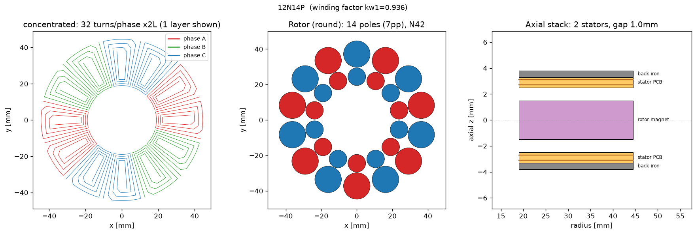
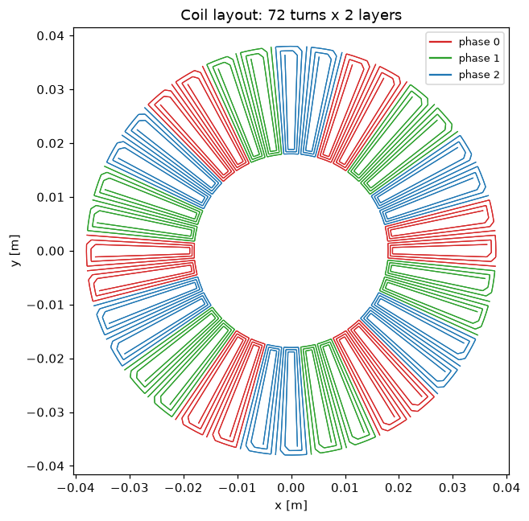
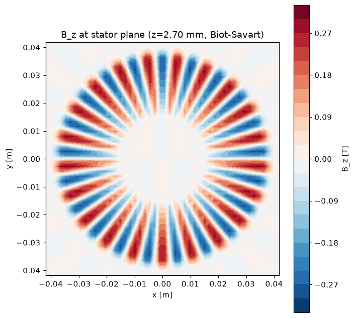

# pcb_motor

**Design a motor that IS a circuit board.**

No windings to wind, no laminations to stack, no shaded-pole mystery meat. A coreless
axial-flux motor where the stator is just... a PCB. Copper spirals do the work of wire,
your board house does the work of a winding shop, and you glue magnets to a disk. This
repo takes you from "I want roughly this much torque in roughly this much space" to
Gerber-ready KiCad files you upload to JLCPCB.



Under the hood it's a real analytical physics engine — vectorized Biot–Savart on the
actual copper geometry, Amperian current-loop magnets, proper 3-phase commutation —
plus a coil-artwork generator that emits production KiCad footprints with connectable
terminal pads, and a report generator so you can show your friends numbers.

## The part where you don't read the rest of this

Who are we kidding — you're not going to memorize a CLI. This repo ships a Claude
skill (`.claude/skills/pcb-motor-design`), so you can open [Claude Code](https://claude.com/claude-code)
in the repo and say:

> "design me a pancake motor for a camera gimbal, about 50 mNm continuous, 80 mm max
> diameter, 24 V bus"

and it will interview you about the requirements you forgot you had, seed a design,
iterate it against your envelope, run the feasibility gates, and hand you KiCad files
and an HTML report. That's the intended UX.

If you're the manual-transmission type, [docs/design_guide.md](docs/design_guide.md)
is the full stage-by-stage walkthrough. The rest of this README is the five-minute
version.

## Install

```bash
python3 -m venv .venv
.venv/bin/pip install -e ".[dev]"
source .venv/bin/activate
```

Core deps: numpy, scipy, matplotlib, pyyaml, shapely. The optional `[sweep]` extra
adds `holobench` for interactive parameter-sweep dashboards and optuna search.

## The five-minute tour

Every design lives in a *session* — a directory under `designs/<name>/` holding the
saved motor plus everything you generate for it. Seed one from defaults (a 60 mm-class
12-slot/14-pole twin-stator machine) and it immediately evaluates:

```text
$ pcb-motor new --session my-first-motor
session saved to designs/my-first-motor
requirements skeleton written to designs/my-first-motor/requirements.yaml -- fill in your targets (torque, speed, voltage, envelope, duty)
pcb-motor point  [concentrated, 7pp, N42, 2 stator(s)]
--------------------------------------------------------
  Continuous acceleration             583.1 rad/s^2
  Continuous torque                   15.39 mNm
  Kt (torque constant)                48.48 mNm/A
  Continuous current                 0.3175 A
  Mean airgap |Bz|                   0.1823 T
  ...
  Turns / phase / layer-set              96
  ...
  Phase inductance (air-core)         76.86 uH
  PWM ripple @bus/fsw                 1.626 A pp
  Ext. L for ripple budget             1235 uH
  ...
  Winding factor kw1                 0.9393

!!!!!!!!!!!!!!!!!!!!!!!!!!!!!!!!!!!!!!!!!!!!!!!!!!!!!!!!
WARNINGS (1):
  ! PWM ripple 1.63 A pp exceeds the 0.10 A budget (17x) at 12 V bus / 24 kHz / 30% of I_cont: not drivable without ~1235 uH/phase external inductance -- see design guide Stage 5.
!!!!!!!!!!!!!!!!!!!!!!!!!!!!!!!!!!!!!!!!!!!!!!!!!!!!!!!!
```

The skeleton `requirements.yaml` is for your torque/speed/voltage/envelope/duty
targets, so the design and its requirements travel together. And yes — the default
design greets you with a wall of exclamation marks. That's the no-choke feasibility
gate doing its job (air-core PCB windings have tiny inductance; the design guide's
Stage 5 is entirely about this). The tool would rather shout now than after you've
ordered boards.

Poke at the design without committing to anything — `--set` overrides any
`MotorDesign` field on top of the saved session, and `pcb-motor fields` prints every
settable field, grouped, with its default and meaning, so you never have to guess a
name:

```text
$ pcb-motor point --session my-first-motor --set trace_width_m=0.2e-3
pcb-motor point  [concentrated, 7pp, N42, 2 stator(s)]
--------------------------------------------------------
  Continuous acceleration             622.8 rad/s^2
  Continuous torque                   16.44 mNm
  ...
```

Then generate the deliverables:

```text
$ pcb-motor report --session my-first-motor
design report written to designs/my-first-motor/design_report.html

$ pcb-motor datasheet --session my-first-motor
datasheet written to designs/my-first-motor/datasheet.md

$ pcb-motor export --session my-first-motor --single-coil --out designs/my-first-motor/coil.kicad_mod
KiCad footprint written to designs/my-first-motor/coil.kicad_mod (single coil: 1 traces,
1557 fp_line segments, width 0.150 mm on F.Cu)
```

That `export` is the quick eyeball-it-in-KiCad artwork. When you're actually heading
to a board house, `pcb-motor footprint --session <name>` builds the production
two-sided filled-copper stator footprint — net-bearing terminal pads, via stitch,
clearance-verified against JLC rules *before* it writes — and `--project` wraps it
in a complete KiCad project with the WYE pre-wired. Rounding out the CLI: `config`
(the setup figure), `showcase` (the shareable single-file story page — see below),
`compare` (sessions side by side), and `sweep` / `optimize` (interactive dashboards
and optuna, with the `[sweep]` extra).

Here's a 36-slot / 42-pole demo winding the engine generated, and the actual
Biot–Savart field its rotor puts through the stator plane:





## What you get

- **Coil artwork** — `.kicad_mod` footprints of the real winding. The quick exporter
  gives `fp_line` traces; the production builder
  (`pcb_motor.kicad.build_footprint`) emits two-sided filled-copper artwork with
  **connectable net-bearing terminal pads**, mirrored back-layer copper (so the two
  layers add torque instead of cancelling it — ask us how we know), a via stitch
  between layers, and in-footprint series bridges. It shapely-verifies every clearance
  against JLC 1 oz rules *before* writing, and refuses to emit a failing board.
- **A full KiCad project** — `pcb_motor.kicad.build_kicad_project` writes a symbol
  library, a schematic with the 3-phase WYE pre-wired to a single stator symbol, and
  library tables. Pin numbers equal footprint pad names by construction.
- **An HTML design report and Markdown datasheet** — every headline number plus the
  setup figures, ready to paste into a build log.
- **Honest feasibility numbers** — thermal continuous current, drive voltage at that
  current, current density, airgap shear, rotor inertia, and the
  "do I need a series choke for my ODrive" gate: air-core PCB windings have tiny
  inductance, so the tool reports worst-case PWM current ripple
  (`v_bus / (4·L·f_pwm)`) and the external inductance needed to hit your ripple
  budget. Most small PCB motors need that choke. Better to find out now.

## A real worked example

[`examples/odrive80/`](examples/odrive80/) is a complete design session, committed
as-is: an 80 mm, 42-pole dual-stator pancake built entirely from off-the-shelf round
disc magnets (42× Ø5 mm + 42× Ø4 mm N52), on two ordinary 2-layer 1 oz JLC boards.
The tool's verdict: **Kt 20.75 mNm/A, 20.5 mNm continuous (±30%) at just under 1 A
and 3 Ω** — and an honest one-liner the brief didn't want to hear: *driving it
choke-free from an ODrive is infeasible by 32×; budget ~204 µH of external inductance
per phase.* The directory has the requirements, the saved design, the datasheet, the
clearance-verified footprint, the ready KiCad project, and a README telling the whole
story — including the part where the tool says no.

The best way to meet it is the **[showcase report](https://paristhomas.github.io/pcb_motor/examples/odrive80/report.html)**
([examples/odrive80/report.html](examples/odrive80/report.html) in the repo) — one
self-contained HTML page from `pcb-motor showcase`: the rotor spinning over the real
copper with the Biot–Savart field, the zoomable board artwork, the exploded stack,
the trace-width trade charts, and the FAIL verdict in large print. There's a
[second page for the default machine](https://paristhomas.github.io/pcb_motor/examples/demo_12n14p/report.html)
([examples/demo_12n14p/report.html](examples/demo_12n14p/report.html)) if you want
to see what every fresh design gets for free.

## The physics, honestly

> This is an **analytical, feasibility-grade model: treat absolute torque as ±30%.**
> The field solver itself is validated to <1% against closed-form solutions — the
> error budget is dominated by what the model *doesn't* capture: magnet Br tolerance
> and fringing, your actual assembled air gap (the single most sensitive parameter,
> and the one your 3D-printed parts control), and etching/plating variation in the
> copper. Relative comparisons between designs are much better than ±30%. Calibrate
> against FEMM or a bench coil before you commit money to a build. Details and
> validation notes in [docs/physics.md](docs/physics.md).

Limitations, so nobody is surprised later:

- **No magnetic saturation modeling.** Fine for coreless (air doesn't saturate), but
  the optional back-iron model is method-of-images with µ→∞ plates — a *sanity
  flag*, not a design tool. It also ignores eddy/hysteresis drag in the plate.
- **Thermal model is a lumped convection balance** (`h·A·ΔT`) with a guessed film
  coefficient — good for "is this thermally plausible", not for hot-spot prediction.
- **Inductance is ±20%** (Neumann double sum) — right for "do I need a choke", wrong
  for filter design.
- **Dual-rotor axial attraction is reported as a warning, not a number.** Two magnet
  disks facing each other pull *hard*. Size your spacer, hub, and assembly jig for it.
- No cogging (coreless — there is none), no acoustic, no bearing model, no FEA.

## Docs

- [docs/design_guide.md](docs/design_guide.md) — the full walkthrough: requirements →
  seed → evaluate → iterate → feasibility gate → KiCad export → fab notes.
- [docs/physics.md](docs/physics.md) — how the model works and where it lies.
- [docs/jlc_design_rules.md](docs/jlc_design_rules.md) — JLCPCB rules and IPC current
  capacity numbers the coil generator designs against.

A note on housekeeping: `designs/` is where your design sessions land. Session
definitions (`motor.json`, datasheets) are small and committable; the heavy generated
artifacts there (HTML reports, PNGs, CSVs) are gitignored.

## License

MIT. Motors want to be free.
