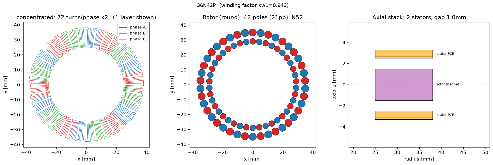

# dualstator80-36n42p — an 80 mm no-choke attempt, honestly lost

This directory is a complete, committed design session: what the tool was asked for,
what it designed, and what it said about the result — including the part the brief
didn't want to hear. Everything here was produced by `pcb-motor` commands against
this repo; nothing is retouched. All absolute numbers carry the model's honesty band:
**±30% on torque** (see [docs/physics.md](../../docs/physics.md)).

## The brief

From [`requirements.yaml`](requirements.yaml): a flat pancake motor, **80 mm outer
diameter hard limit**, driven by an ODrive, **no external inductors/chokes if
possible**, maximize continuous torque. Fixed by the customer: 21 pole pairs
(→ the verified 36N42P combo), two stators in series (one PCB each side of a single
rotor disk), 2 copper layers per board, 0.8 mm FR4, 1 oz copper (JLC 5/5 mil),
1.0 mm air gap per side, no iron anywhere. Magnet stock: **off-the-shelf round disc
magnets only** — real sizes Ø3/Ø4/Ø5/Ø6 mm, N52.

## The design hunt, condensed

**Magnet ring geometry.** With `magnet_topology=round`, 42 poles have to fit around
a ring inside a 40 mm radius board. The packing that won: **42× Ø5×3 mm N52 discs at
r = 35 mm** (outer ring) plus **42× Ø4×3 mm at r = 29 mm** (inner ring), one disc pair
per pole. At r = 35 mm the pole pitch is 5.24 mm, so adjacent Ø5 discs sit ~0.24 mm
apart — the model is perfectly happy with that; your 3D printer is not. Print the
carrier with open-walled pockets (adjacent discs repel, and that repulsion holds each
disc against its pocket rim) or accept a coarser packing. The design guide now has a
section on exactly this.

**Copper annulus tracking.** Torque comes from radial copper sitting under the
magnets, so the active annulus was moved out to track the disc rings:
`r_inner=25 mm`, `r_outer=38 mm` (the discs span ~27–37.5 mm). Copper inside r = 25 mm
was doing nothing but adding resistance.

**The trace-width trade.** This is where the no-choke hope went to die, with numbers.
Inductance grows ~N² while torque-per-ohm falls, so we swept trace width both ways
([`compare.md`](compare.md) has the head-to-head):

| | `dualstator80-36n42p` (0.50 mm traces) | `dualstator80-36n42p-maxL` (0.127 mm traces) |
|---|---|---|
| Kt | 20.75 mNm/A | 48.97 mNm/A |
| Continuous torque | **20.52 mNm** | 16.15 mNm |
| R (total, series) | 3.0 Ω | 27.0 Ω |
| L (total, series) | 6.7 µH | 45.5 µH |
| Choke still needed | 204 µH/phase | 586 µH/phase |

Even maxing out turns at the fab's minimum trace width — a 7× inductance gain, paid
for with a quarter of the continuous torque — leaves the winding an order of
magnitude short of choke-free. So the committed design takes the torque.

## What the tool told us

The saved design ([`motor.json`](motor.json), full numbers in
[`datasheet.md`](datasheet.md)): **Kt 20.75 mNm/A, 20.5 mNm continuous (±30%) at
0.99 A**, R 3.0 Ω and L 6.7 µH (totals for both boards in series), kw1 0.943,
3.9 V drive voltage at continuous current. And the verdict, verbatim from
`pcb-motor point --session dualstator80-36n42p` at the most favorable ODrive operating point
(12 V bus, 48 kHz PWM — i.e. an ODrive Pro/S1; a stock v3.6 at 24 kHz doubles the
ripple):

```text
!!!!!!!!!!!!!!!!!!!!!!!!!!!!!!!!!!!!!!!!!!!!!!!!!!!!!!!!
WARNINGS (1):
  ! PWM ripple 9.35 A pp exceeds the 0.30 A budget (32x) at 12 V bus / 48 kHz / 30% of I_cont: not drivable without ~204 uH/phase external inductance -- see design guide Stage 5.
!!!!!!!!!!!!!!!!!!!!!!!!!!!!!!!!!!!!!!!!!!!!!!!!!!!!!!!!
```

**The no-choke brief is infeasible, by 32×.** Not marginal, not fixable with a knob:
9.35 A pp of PWM ripple on a motor rated for 0.99 A continuous. At 24 V / 24 kHz
(stock v3.6 territory) the requirement grows to ~836 µH/phase. The honest answer is
three chokes:

> **Choke shopping spec:** ≥ 204 µH per phase at 12 V / 48 kHz → buy **220–330 µH
> shielded drum-core power inductors, I_sat ≥ 1.5 A, DCR ≤ 0.3 Ω** — Bourns SRR1260
> class, three of them, one in series with each phase lead.

## The deliverables

- [`datasheet.md`](datasheet.md) — every headline number, including the explicit
  PWM-ripple gate rows (bare-winding ripple, FAIL, required choke).
- [`stator_full_2side.kicad_mod`](stator_full_2side.kicad_mod) — the production
  two-sided filled-copper stator footprint, tapered 0.50 mm traces at 0.127 mm space,
  **clearance-verified before writing: PASS, worst clearance 0.1365 mm against the
  0.127 mm JLC 1 oz rule**.
- [`kicad/`](kicad/) — the complete KiCad project: single stator symbol, WYE
  pre-wired schematic, library tables, and the footprint vendored as
  `pcb_motor.pretty/coil_full_2side.kicad_mod`. Order two boards; wire them in
  **series** (never parallel — Stage 5 of the design guide says why).
- [`setup.png`](setup.png) — winding, rotor, and axial stack figure.
- [`compare.md`](compare.md) — the trace-width trade study above.



## Reproduce / iterate it

Sessions live under `designs/` (gitignored working area). To pick this design up:

```bash
mkdir -p designs/dualstator80-36n42p
cp examples/dualstator80-36n42p/motor.json examples/dualstator80-36n42p/requirements.yaml designs/dualstator80-36n42p/
.venv/bin/pcb-motor point --session dualstator80-36n42p          # re-evaluate (~30-60 s)
.venv/bin/pcb-motor footprint --session dualstator80-36n42p --project   # rebuild the KiCad artifacts
```

Every number above is the analytical model talking. Before spending real money:
measure the as-built air gap, bench-check Kt, and read
[docs/physics.md](../../docs/physics.md) for exactly which corners the model cuts.
